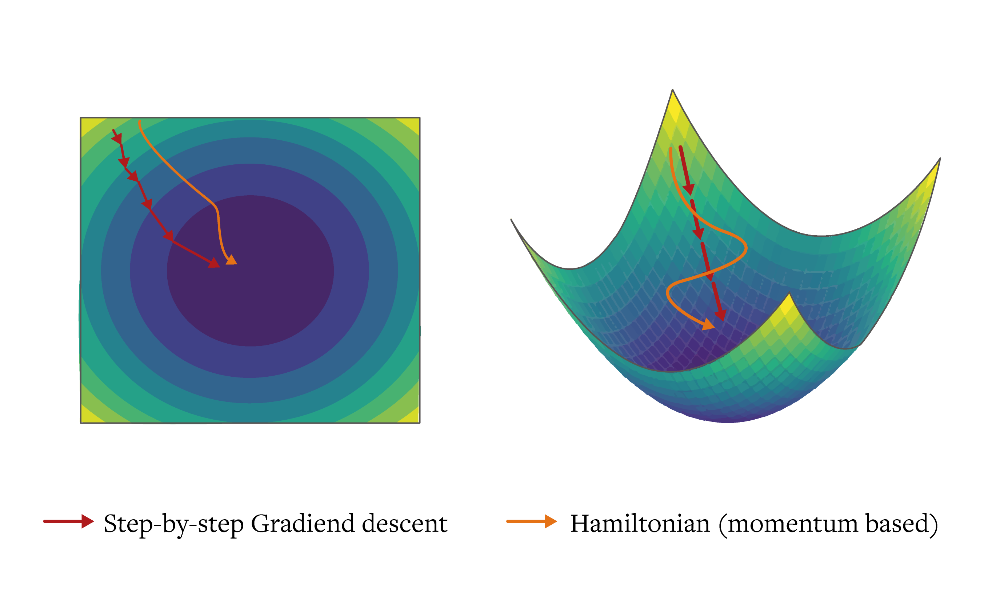

<table>
<tr>
<td></td>
<td></td>
</tr>
</table>

# Hamiltonian Neural Network

<div align="center">
  
</div>

Hamiltonian AI is a Python library that implements Hamiltonian-inspired approaches for optimizing AI models. By leveraging principles from Hamiltonian mechanics, this library provides novel optimization techniques that enhance model performance and stability in both multi-hop question answering and credit scoring tasks.

## What Problem Does This Solve?
Standard neural network optimization faces fundamental mathematical challenges:

**Instability**: Gradient descent can oscillate or diverge in complex loss landscapes
Poor exploration: Traditional optimizers often get trapped in suboptimal local minima
Inconsistent convergence: Training dynamics vary unpredictably across different problems

**How We Solve It**: By borrowing mathematical principles from Hamiltonian mechanics, we create optimization algorithms that preserve geometric structure and provide more stable, predictable training dynamics.

Note: For a complete visual presentation of the theoretical foundations, see our detailed presentation here (https://github.com/Javihaus/hamiltonian_ai/blob/main/docs/presentations/Hamiltonian%20Optimization_v1.pdf).

## The Physical Analogy
In classical mechanics, a pendulum's motion is governed by energy conservation. As it swings, it exchanges potential energy (height) for kinetic energy (motion), but total energy remains constant.
<p align="center">
  
  <br><em>Figure: A frictionless pendulum conserves total energy, creating stable, predictable trajectories in phase space</em>
</p>

We adapt this principle for optimization

### The Mathematical Bridge
We map this physical intuition to neural network optimization:
<table>
  <thead>
    <tr>
      <th style="background-color: #f0f0f0; padding: 10px; border: 1px solid #ddd;">Physical System</th>
      <th style="background-color: #f0f0f0; padding: 10px; border: 1px solid #ddd;">Neural Network Optimization</th>
    </tr>
  </thead>
  <tbody>
    <tr>
      <td style="padding: 8px; border: 1px solid #ddd;"><strong>Position (q)</strong></td>
      <td style="padding: 8px; border: 1px solid #ddd;">Model parameters (θ)</td>
    </tr>
    <tr>
      <td style="padding: 8px; border: 1px solid #ddd;"><strong>Momentum (p)</strong></td>
      <td style="padding: 8px; border: 1px solid #ddd;">Parameter update velocities</td>
    </tr>
    <tr>
      <td style="padding: 8px; border: 1px solid #ddd;"><strong>Potential Energy</strong></td>
      <td style="padding: 8px; border: 1px solid #ddd;">Loss function value</td>
    </tr>
    <tr>
      <td style="padding: 8px; border: 1px solid #ddd;"><strong>Kinetic Energy</strong></td>
      <td style="padding: 8px; border: 1px solid #ddd;">Gradient magnitude</td>
    </tr>
    <tr>
      <td style="padding: 8px; border: 1px solid #ddd;"><strong>Total Energy</strong></td>
      <td style="padding: 8px; border: 1px solid #ddd;">Combined optimization "energy"</td>
    </tr>
  </tbody>
</table>


### Hamiltonian Formulation

$$\begin{align*}H(q, p) = T(p) + V(q)\end{align*}$$

where:

$T(p)$: Kinetic energy (parameter update costs)

$V(q)$: Potential energy (loss function)

For neural network optimization, we define:

$$\begin{align*}H(\theta, m) = \frac{1}{2}∥m∥^2 + L(\theta)\end{align*}$$

where:

$\theta$: model parameters (analogous to position)

$m$: momentum terms (analogous to velocity)

$L(\theta)$: loss function (analogous to potential energy)

## Hamilton's Equations for Optimization
Classical Hamilton's equations govern how systems evolve:

$$\begin{align}
\frac{dq}{dt} &= \frac{\partial H}{\partial p} \
\frac{dp}{dt} &= -\frac{\partial H}{\partial q}
\end{align}$$
These equations capture a profound physical principle: systems evolve along paths that preserve their geometric structure. For neural network optimization, we translate this directly:
$$\begin{align}
\frac{d\theta}{dt} &= \frac{\partial H}{\partial m} = m \
\frac{dm}{dt} &= -\frac{\partial H}{\partial \theta} = -\nabla L(\theta)
\end{align}$$

Physical Interpretation: Just as a pendulum's position changes according to its momentum, our model parameters $\theta$ update according to their momentum $m$. And just as momentum changes due to forces (negative gradient of potential energy), our momentum updates according to the negative gradient of the loss function.

Why This Matters: This isn't just mathematical elegance - it provides a principled way to maintain optimization stability. Traditional gradient descent can be viewed as a crude approximation that ignores momentum conservation, leading to oscillations and instability.

### Discrete Implementation
For practical computation, we discretize these continuous equations using symplectic integration:

$$\begin{align}
m_{t+1} &= m_t - \eta \nabla L(\theta_t) \
\theta_{t+1} &= \theta_t + \eta m_{t+1}
\end{align}$$

Notice the crucial detail: we use the *updated* momentum $m_{t+1}$ in the parameter update. This ordering preserves the symplectic structure and maintains long-term stability.

### Symplectic Integration: Preserving Structure
Standard numerical integration methods can destroy the geometric properties that make Hamiltonian systems stable. Symplectic integration specifically preserves the phase space structure.

<p align="center">
  
  <br><em>Figure 3: Symplectic geometry preserves phase space areas and trajectories, ensuring optimization stability over long timescales</em>
</p>

The symplectic form in local coordinates is:

$$\begin{align}
\omega = \sum_i d\theta_i \land dm_i​
\end{align}$$

This mathematical object captures the idea that parameter space has an inherent geometric structure. Our optimization algorithm respects this structure, leading to:

- 1- Energy conservation: Total "energy" doesn't drift due to numerical errors
- 2- Volume preservation: The optimization doesn't artificially expand or contract parameter regions
- 3- Long-term stability: No accumulation of numerical artifacts over many iterations

## Benefits of Hamiltonian Approach
- 1- Energy Conservation: The conservation of the Hamiltonian leads to more stable optimization trajectories.
- 2- Momentum-Based Exploration: The system can "roll past" local minima while maintaining exploratory behavior.
- 3- Geometric Structure Preservation: Symplectic integration preserves the geometric properties of the optimization space.

## Practical application

### HamiltonianNN
A neural network architecture incorporating Hamiltonian formalism (assuming there is a conveserved quantity analogous to energy in phisycal systems):

```python
model = HamiltonianNN(
    input_dim=10,           # Input dimension
    hidden_dims=[64, 32],   # Hidden layer dimensions
    activation='leaky_relu', # Activation function ('leaky_relu' or 'relu')
    dropout_rate=0.2        # Dropout rate for regularization
)
```

### AdvancedSymplecticOptimizer
A custom optimizer based on symplectic integration:

```python
optimizer = AdvancedSymplecticOptimizer(
    params,                 # Model parameters
    lr=1e-2,               # Learning rate
    beta=0.9,              # Momentum coefficient
    epsilon=1e-8           # Small constant for numerical stability
)
```

### Hamiltonian Loss Function
Custom loss function incorporating Hamiltonian principles:

```python
loss = hamiltonian_loss(
    outputs,               # Model outputs
    labels,               # True labels
    model,                # Model instance
    reg_coeff=0.01       # Regularization coefficient
)
```

The loss function combines:
- Base loss (cross-entropy)
- Regularization term based on parameter norms

## Parameter Configuration Guide

### Model Parameters

#### HamiltonianNN Configuration
```python
model = HamiltonianNN(
    input_dim,          # Required: Integer, dimension of input features
    hidden_dims,        # Required: List[int], dimensions of hidden layers
    activation='leaky_relu',  # Optional: string, either 'leaky_relu' or 'relu'
    dropout_rate=0.2    # Optional: float between 0 and 1
)
```

| Parameter | Type | Configurable | Default | Description |
|-----------|------|--------------|---------|-------------|
| input_dim | int | ✅ Required | None | Input feature dimension |
| hidden_dims | List[int] | ✅ Required | None | List of hidden layer dimensions |
| activation | str | ✅ Optional | 'leaky_relu' | Activation function ('leaky_relu' or 'relu' only) |
| dropout_rate | float | ✅ Optional | 0.2 | Dropout probability |

### Optimizer Parameters

#### AdvancedSymplecticOptimizer Configuration
```python
optimizer = AdvancedSymplecticOptimizer(
    params,            # Required: model parameters
    lr=1e-2,          # Optional: learning rate
    beta=0.9,         # Optional: momentum coefficient
    epsilon=1e-8      # Optional: numerical stability constant
)
```

| Parameter | Type | Configurable | Default | Description |
|-----------|------|--------------|---------|-------------|
| params | Iterable | ✅ Required | None | Model parameters to optimize |
| lr | float | ✅ Optional | 1e-2 | Learning rate |
| beta | float | ✅ Optional | 0.9 | Momentum decay factor |
| epsilon | float | ✅ Optional | 1e-8 | Small constant for numerical stability |

### Loss Function Parameters

#### hamiltonian_loss Configuration
```python
loss = hamiltonian_loss(
    outputs,           # Required: model outputs
    labels,           # Required: true labels
    model,            # Required: model instance
    reg_coeff=0.01    # Optional: regularization coefficient
)
```

| Parameter | Type | Configurable | Default | Notes |
|-----------|------|--------------|---------|-------|
| outputs | Tensor | ✅ Required | None | Model predictions |
| labels | Tensor | ✅ Required | None | True labels |
| model | HamiltonianNN | ✅ Required | None | Model instance |
| reg_coeff | float | ✅ Optional | 0.01 | Regularization strength |
| base_loss | Function | ❌ Fixed | CrossEntropy | Base loss function (not configurable) |

### Data Processing Parameters

#### prepare_data Configuration
```python
train_dataset, test_dataset, scaler = prepare_data(
    X,                # Required: input features
    y,                # Required: target labels
    test_size=0.2,    # Optional: test set proportion
    apply_smote=True  # Optional: whether to apply SMOTE
)
```

| Parameter | Type | Configurable | Default | Description |
|-----------|------|--------------|---------|-------------|
| X | np.ndarray | ✅ Required | None | Input features |
| y | np.ndarray | ✅ Required | None | Target labels |
| test_size | float | ✅ Optional | 0.2 | Proportion of test set |
| apply_smote | bool | ✅ Optional | True | Whether to apply SMOTE |

### Fixed (Non-Configurable) Components

The following components are fixed and cannot be modified:

1. **Base Loss Function**:
   - Fixed to CrossEntropy
   - No option to change to other loss functions

2. **Optimizer Type**:
   - Uses Symplectic integration
   - Core optimization algorithm cannot be modified

3. **Model Architecture**:
   - Basic structure is fixed (fully connected layers)
   - Only layer dimensions and activation functions can be modified

4. **Regularization Type**:
   - Uses L2 regularization
   - Regularization method cannot be changed

### Example of Complete Configuration

```python
# Model initialization with all configurable parameters
model = HamiltonianNN(
    input_dim=10,
    hidden_dims=[64, 32],
    activation='leaky_relu',
    dropout_rate=0.3
)

# Optimizer with all configurable parameters
optimizer = AdvancedSymplecticOptimizer(
    model.parameters(),
    lr=0.01,
    beta=0.95,
    epsilon=1e-8
)

# Data preparation with all configurable parameters
train_dataset, test_dataset, scaler = prepare_data(
    X,
    y,
    test_size=0.2,
    apply_smote=True
)

# Training loop with loss configuration
outputs = model(inputs)
loss = hamiltonian_loss(
    outputs,
    labels,
    model,
    reg_coeff=0.01
)
```

## Installation

```bash
pip install hamiltonian_ai
```

## Detailed Usage Example

```python
import torch
from hamiltonian_ai.models import HamiltonianNN
from hamiltonian_ai.optimizers import AdvancedSymplecticOptimizer
from hamiltonian_ai.loss_functions import hamiltonian_loss
from hamiltonian_ai.data_processing import prepare_data
from hamiltonian_ai.utils import evaluate_model

# 1. Data Preparation
X, y = load_your_data()  # Your data loading function
train_dataset, test_dataset, scaler = prepare_data(
    X, 
    y,
    test_size=0.2,
    apply_smote=True  # Handle imbalanced datasets
)

# 2. Create Data Loaders
train_loader = torch.utils.data.DataLoader(
    train_dataset,
    batch_size=32,
    shuffle=True
)
test_loader = torch.utils.data.DataLoader(
    test_dataset,
    batch_size=32
)

# 3. Initialize Model
model = HamiltonianNN(
    input_dim=X.shape[1],
    hidden_dims=[64, 32],
    activation='leaky_relu',
    dropout_rate=0.2
)

# 4. Setup Optimizer
optimizer = AdvancedSymplecticOptimizer(
    model.parameters(),
    lr=0.01,
    beta=0.9,
    epsilon=1e-8
)

# 5. Training Loop
device = torch.device("cuda" if torch.cuda.is_available() else "cpu")
model.to(device)

for epoch in range(10):
    model.train()
    for batch_X, batch_y in train_loader:
        batch_X, batch_y = batch_X.to(device), batch_y.to(device)
        
        optimizer.zero_grad()
        outputs = model(batch_X)
        loss = hamiltonian_loss(outputs, batch_y, model, reg_coeff=0.01)
        loss.backward()
        optimizer.step()
        
    # Evaluation
    if epoch % 2 == 0:
        metrics = evaluate_model(model, test_loader, device)
        print(f"Epoch {epoch}: Accuracy={metrics[0]:.4f}, F1={metrics[3]:.4f}")
```

## Advanced Features

### Data Processing
The `prepare_data` function includes:
- Standardization of features
- Train-test splitting
- SMOTE for handling imbalanced datasets
- Dataset creation for PyTorch

### Evaluation Metrics
The `evaluate_model` function returns:
- Accuracy
- Precision
- Recall
- F1 Score
- AUC-ROC Score

## Performance Benefits

1. **Stability**: The Hamiltonian approach provides more stable optimization trajectories
2. **Generalization**: Better performance on out-of-time validation in credit scoring
3. **Efficiency**: Improved convergence through symplectic integration

## Research Papers

For theoretical foundations and empirical results:
- [Hamiltonian Neural Networks for Robust Out-of-Time Credit Scoring](https://arxiv.org/abs/2410.10182)
- [Geometric Analysis of Reasoning Trajectories: A Phase Space Approach to Understanding Valid and Invalid Multi-Hop Reasoning in LLMs](https://arxiv.org/abs/2410.04415)


## Examples
For more detailed examples, please check the examples/ directory in our repository:

- Credit Scoring (inlcuding notebook)</br>
   Data for this example is available here: https://zenodo.org/records/8401978  (DOI 10.5281/zenodo.8401977)
- Question Answering (inlcuding notebook and data)

## Documentation
For full documentation, including API reference and tutorials, visit our documentation page.


## Contributing
We welcome contributions to Hamiltonian AI! Here are some ways you can contribute:

Report bugs and request features by opening issues.
Submit pull requests with bug fixes or new features.
Improve documentation or add examples.
Share your experience using Hamiltonian AI.

Please read our Contribution Guidelines for more details.

## Development Setup
To set up the development environment:

```bash
git clone https://github.com/yourusername/hamiltonian_ai.git
cd hamiltonian_ai
pip install -e .[dev]
```

## Run tests using

```bash
pytest
```

## References

- Amari, S. (2016). Information geometry and its applications (Vol. 194). Springer.
- Bergstra, J., Yamins, D., & Cox, D. (2013). Making a science of model search: Hyperparameter optimization
in hundreds of dimensions for vision architectures. International Conference on Machine Learning, 115–123.
- Betancourt, M. (2017). A conceptual introduction to Hamiltonian Monte Carlo. ArXiv Preprint
ArXiv:1701.02434.
- Boyd, S. and Vandenberghe, L. (2004). Convex Optimization. Cambridge University Press.
- Chin, S. A., & Kidwell, D. W. (2000). Higher-order force gradient symplectic algorithms. Physical Review E,
62(6), 8746.
- De León, M., & Rodrigues, P. R. (2011). Generalized Classical Mechanics and Field Theory: a geometrical
approach of Lagrangian and Hamiltonian formalisms involving higher order derivatives. Elsevier.
- Demmel, J.W. (1997). Applied Numerical Linear Algebra. SIAM.
- Easton, R. W. (1993). Introduction to Hamiltonian dynamical systems and the N-body problem (KR Meyer
and GR Hall). SIAM Review, 35(4), 659.
- Friston, K. (2010). The free-energy principle: a unified brain theory? Nature Reviews Neuroscience, 11(2),
127–138.
- Goldman, W. M. (1984). The symplectic nature of fundamental groups of surfaces. Advances in
Mathematics, 54(2), 200–225.
- Goldstein, P., & Poole, C. (2002). Classical Mechanics. Addison Wesley.
- Hairer, E., Lubich, C. and Wanner, G. (2006). Geometric Numerical Integration: Structure-Preserving
Algorithms for Ordinary Differential Equations. Springer.
- Jain, P. and Kar, P. (2017). Non-convex Optimization for Machine Learning. Foundations and Trends® in
Machine Learning, 10(3-4), pp.142-336.
- Kounios, J., & Beeman, M. (2014a). The cognitive neuroscience of insight. Annual Review of Psychology,
65(1), 71–93.
- Li, X., Ling, S., Strohmer, T. and Wei, K. (2019). Rapid, Robust, and Reliable Blind Deconvolution via
Nonconvex Optimization. Applied and Computational Harmonic Analysis, 47(3), pp.893-934.
- Marsden, J. E., & Ratiu, T. S. (2013). Introduction to mechanics and symmetry: a basic exposition of
classical mechanical systems (Vol. 17). Springer Science & Business Media.
- Negahban, S., Yu, B., Wainwright, M.J. and Ravikumar, P.K. (2009). A Unified Framework for High-
Dimensional Analysis of M-Estimators with Decomposable Regularizers. In Advances in Neural
Information Processing Systems (pp. 1348-1356).
- Prugovečki, E. (1979). Stochastic phase spaces and master Liouville spaces in statistical mechanics.
Foundations of Physics, 9(7–8), 575–587.

## Citation

If you use Hamiltonian AI in your research, please cite our paper:

```BibTex
@article{marin2024hamiltonian,
  title={Hamiltonian Neural Networks for Robust Out-of-Time Credit Scoring},
  author={Mar{\'\i}n, Javier},
  journal={arXiv preprint arXiv:2410.10182},
  year={2024}
}
```

```BibTex
@article{marin2024optimizing,
  title={Geometric Analysis of Reasoning Trajectories: A Phase Space Approach to Understanding Valid and Invalid Multi-Hop Reasoning in LLMs},
  author={Marin, Javier},
  journal={arXiv preprint arXiv:2410.04415},
  year={2024}
}
```


## Contact
For any questions or feedback, please open an issue on our GitHub repository or contact us at javier@jmarin.info

